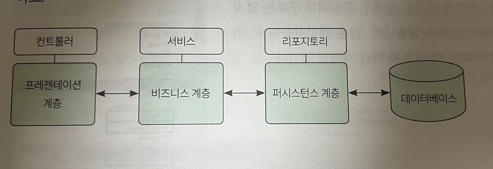
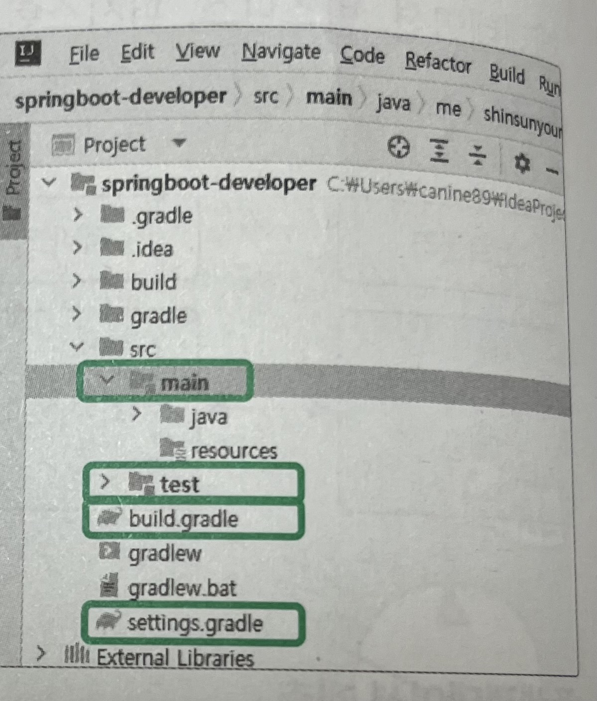
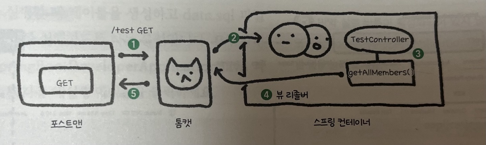

## 03장 스프링부트 3 구조 이해하기

스프링 부트는 각 계층이 양 옆의 계층과 통신하는 구조

- 계층 : 각자의 역할과 책임이 있는 어떤 소프트웨어의 구성 요소

#### 프레젠테이션 계층
- 컨트롤러
- HTTP 요청을 받고 이 요청을 비지니스 게층으로 전송하는 역할
#### 비지니스 계층
- 서비스
- 비지니스 로직을 처리
- 비지니스 로직 : 서비스를 만들기 위한 로직(예외 처리 로직, 프로세스를 구현하기 위한 로직)

#### 퍼시스턴스 계층
- 레포지토리
- db 관련 로직 처리

### 스프링 부트 프로젝트 디렉터리 구성

#### main
- 실제 코드를 작성하는 공간
- 프로젝트 실행에 필요한 소스코드나 리소스 파일을 작성

#### test
- 프로젝트의 소스 코드를 테스트할 목적의 코드나 리소스 파일을 작성하는 공간

#### build.gradle
- 빌드를 설정하는 파일을 작성하는 공간
- 의존성이나 플러그인 설정 등과 같이 빌드에 필요한 설정

#### setting.gradle
- 빌드할 프로젝트의 정보를 설정

#### main > resources
- templates : 뷰 관련 파일(HTML)
- resources : 정적 파일(JS,CSS,이미지)
- applicaton.yml : 스프링 부트 설정 파일. 서버 실행 시 자동으로 로딩

### 스프링 부트 요청 - 응답 과정 한방에 이해하기

1. 포스트맨에서 톰캣에 /test GET 요청 -> 이 요청은 스프링 부트 내로 이동
2. 스프링 부트의 디스패처 서블릿 녀석이 URL을 분석하고, 이 요청을 처리할 수 있는 컨트롤러를 찾음
3. 해당 요청을 처리할 수 있는 메서드를 찾으면 해당 메서드와 요청을 매치 -> 해당 메소드는 비즈니스 계층과 퍼시스턴스 계층을 통해 필요 데이터를 가져옴
4. 뷰 리졸버는 템플릿 엔진을 사용해 HTML 문서를 만들거나 JSOH,XML 등의 데이터를 생성
5. 찾은 데이터를 return해 포스트맨에서 볼 수 있음