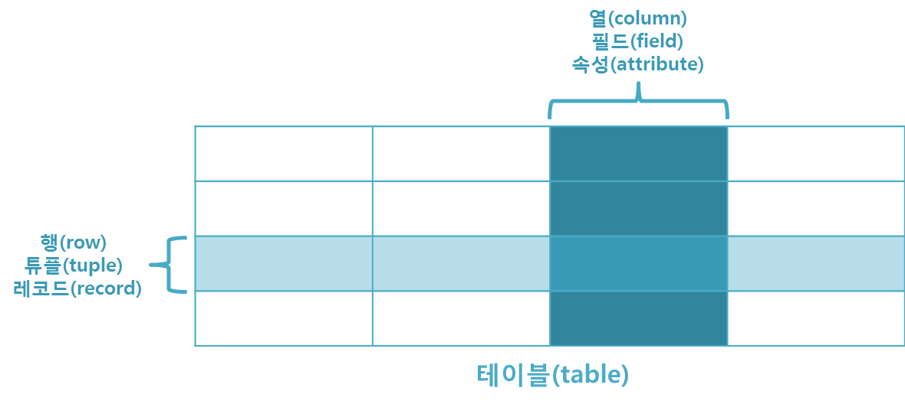

## 5장 데이터베이스 조작이 편해지는 ORM

### 데이터베이스란?
- 데이터를 효율적으로 보관하고 꺼내 볼 수 있는 곳

#### DBMS
- db는 많은 사람이 공유할 수 있어야 하므로 동시 접근이 필요함
- 이런 요구사항을 만족하면서 효율적으로 db를 관리하기 위한 소프트웨어
- MySQL, 오라클, H2
- 관계형, 객체-관계형,도큐먼트형, 비관계형 등으로 분류

#### RDBMS
- 관계형 DBMS
- 테이블 형태로 이루어진 데이터 저장소

#### H2
- 스프링부트가 지원하는 인메모리 RDBMS
- 자바로 작성
- 애플리케이션 자체 내부에 데이터를 저장 -> 애플리케이션을 다시 실행하면 데이터 초기화
- 개발시 : H2, 서비스로 올릴 때 : MySQL 사용 -> 도도독도 이랬음

#### db 용어

#### 기본키
- 행을 구분할 수 있는 식별자
- 테이블에서 유일
- 중복값, 수정, NULLx
#### 쿼리
- db 조작 명령문

### ORM
- 객체와 db를 연결해 자바 언어로만 db를 다룰 수 있게 하는 도구
- db의 값을 마치 객체처럼 사용할 수 있음
- ORM 핵심 : ORM 을 사용해 Object와 RDB 사이에 객체지향적으로 다루기 위한 기술
- JPA, Hibernate, EclipseLink
- 장점
  - SQL을 직접 작성하지 않고 사용하는 언어로 db에 접근할 수 있음
  - 객체지향적으로 코드를 작성할 수 있어 비지니스 로직에만 집중 가능
  - db 시스템에 대한 종속성이 줄어듬(김영한이 말했던 그거. 레고 조립하듯이 쉽게 바꿀 수 있다)
  - 매핑하는 정보가 명확하기 때문에 ERD에 대한 의존도를 낮출 수 있고 유지보수 할 때 유리
- 단점
  - 플젝의 복잡성이 커질수록 사용 난이도도 올라감
  - 복잡하고 무거운 쿼리는 ORM으로 해결이 불가능한 경우가 있음

### JPA와 하이버네이트
- JPA
  - 자바에서 표준으로 사용하는 ORM
  - 자바에서 RDB를 사용하는 방식을 정의한 인터페이스
- 하이버네이트
  - 자바 언어를 위한 ORM 프레임워크
  - JPA를 구현한 구현체로, 내부적으로 JDBC API를 사용