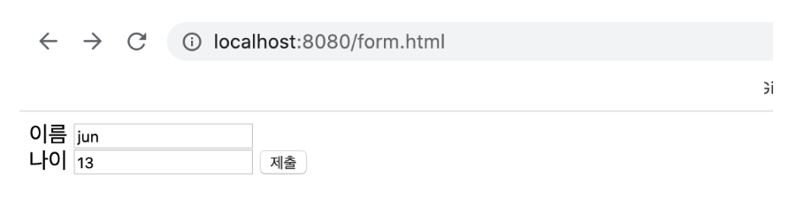
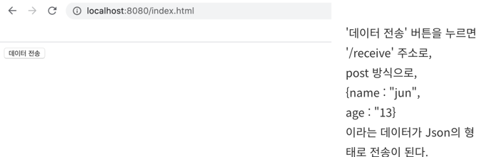
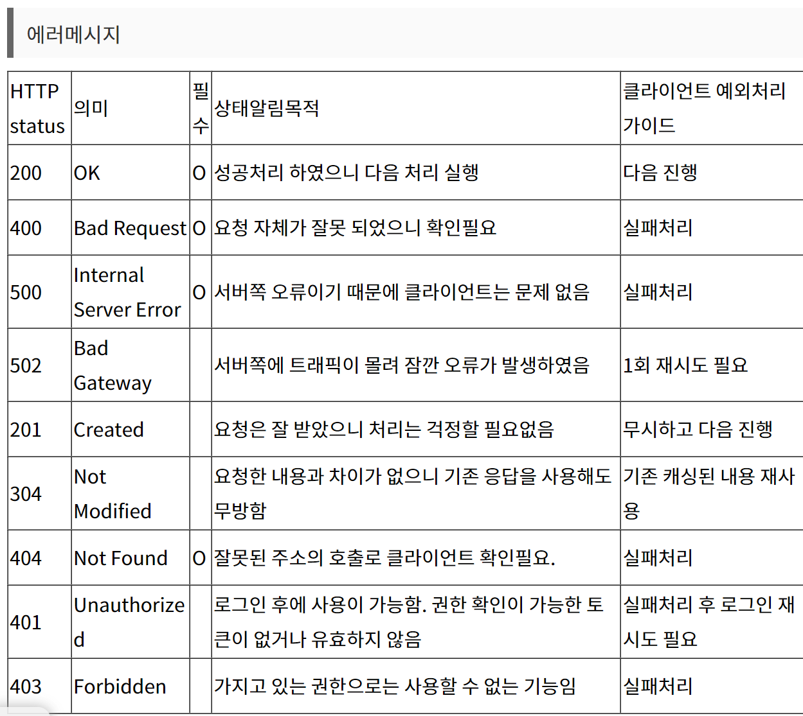

## 6장 블로그 기획하고 API 만들기

### API
- 프로그램 간에 상호작용하기 위한 매개체
- ex) 클라이언트가 '구글 메인 화면을 보여줘'라는 요청을 하면 API가 이 요청을 받아 서버에게 전달하고, 서버가 처리한 결과물을 API로 전달

### REST
- 자원을 이름으로 구분해 자원의 상태를 주고받는 것
- HTTP URI를 통해 자원을 명시하고,
- HTTP Method(POST,GET,PUT,DELETE,PATCH등)을 통해
- 해당 자원(URI)에 대한 CRUD를 적용하는 것

### REST API
- REST를 기반으로 만들어진 API 
- URL 설계 방식을 의미
- 특징
  - 서버/클라이언트 구조
  - 무상태
  - 캐시 처리 가능
  - 계층화
  - 인터페이스 일관성
- 장점 
  - URL만 보고도 무슨 무슨 행동을 하는 API인지 명확하게 알 수 있음
  - 클라 - 서버의 역할이 명확하게 분리
  - HTTP 표준을 사용하는 모든 플랫폼에서 사용할 수 있음
- 단점
  - HTTP 메서드의 형태가 제한적
  - 설계를 하기 위해 공직적으로 제공되는 표준 규약이 없음
  - 구형 브라우저에서 호환이 되지 않아 지원해주지 못하는 동작이 많음(익스폴로어)

### REST API 설계 규칙
  - URL에는 동사를 쓰지 말고, 자원(가져온 데이터)을 표시
```java
./article/1 -> 적합
./get/article/1 -> 부적합
```
- 동사는 HTTP 메서드로
- 언더바 대신 하이폰을 사용
- 마지막에는 슬래시를 포함하지 않는다

### Builder 패턴
```java
// 빌더 패턴 사용하지 않았을 떄
new Article("abc","def")

//빌더 패턴 사용 시
Article.builder()
    .title("abc")
    .content("def")
    .build();

//@Builder 사용시
@Builder
public Article(String title, String content){
    this.title = title;
    this.content = content;
}
```
빌더 패턴 사용하지 않았을 떄 -> 어떤 패턴에 어떤 값이 들어가는지  파악하기 어려움

빌더 패턴 사용 시 -> 어느 필드에 어떤 값이 매칭되는지 직관적으로 보여 가독성을 높임

@Builder 사용 시 -> 빌더 패턴을 자동으로 생성하므로 간편하게 빌더 패턴을 사용해 객체를 만들 수 있음

### DTO vs DAO
- DTO : 계층끼리 데이터를 교환하기 위해 사용하는 객체. 단순히 데이터를 옮기는 역할을 하는 객체이므로 비지니스 로직을 포함하지 않음
- DAO : 데이터베이스와 연결되고 데이터를 조회하고 수정하는데 사용하는 객체. 데이터 수정과 관련된 로직이 포함됨

### 생성자 어노테이션
- @NoArgsConstructor : 기본 생성자 추가
- @AllArgsConstructor : 모든 필드 값을 파라미터로 받는 생성자 추가
- @RequiredArgsConstructor : final이 붙거나 @NotNull이 붙은 필드의 생성자 추가

### @RestController(@Controller + @ResponseBody)
- HTTP Response Body에 객체 데이터를 JSON 형식으로 반환하는 컨트롤러
- @Controller는 주로 view를 잔환, @RestController는 JSON data 반환

### @RequestBody vs @RequestParam
- 컨트롤러에서 데이터를 인자에 할당하는 대표적인 방법

- <form태그로 데이터를 전달할 때>
  
```
@Controller
public class UserController {
	@PostMapping("/receive")
	public String age(@RequestBody String req) {
		return req; //name=jun&age=13
	}
	
	@PostMapping("/receive")
	public String age(@RequestParam String name) {
		return name; //june
	}
}
```
- @RequestBody : 'name=jun&age=13'이라는 String으로 전달
  - @RequestParam : 데이터를 저장하는 이름으로 메서드의 변수명을 설정해주어야 함 -> name에 jun이 전달됨
- <JSON 형식으로 데이터 전달>
  
  - @RequestBody : 가능
  - @RequestParam : url 상에서 데이터를 찾기 때문에 JSON형식으로 데이터를 전달하면 http://localhost:8080/receive 이런 형태의 url에 body에 데이터를 포함하여 전송하면 받을 수 없음
```java
@Controller
public class UserController {

	@PostMapping("/receive")
	public String age(@RequestBody Person person) { //가능
		return "result";
	}

  @PostMapping("/receive")
  public String age(@RequestParam Person person) { //에러 발생 : MissingServletRequestParameterException: Required Person parameter 'person' is not present]
    return "result";
  }
}
```
- 객체 자동 생성
  - @RequestBody : 가능
  - @RequestParam : 불가능
- 각 변수별로 데이터 저장
  - @RequestBody : 불가능
  - @RequestParam : 가능
- 정리
  - url상에서 데이터를 전달하는 경우는 @RequestParam을 이용, 그 외의 경우에는 @RequestBody를 이용

### 응답 코드


### ObjectMapper 클래스
- 이 클래스로 만든 객체는 자바 객체를 JSON 데이터로 변환하는 직렬화 또는 JSON 데이터를 자바에서 사용하기 위해 자바 객체를 변환하는 역직렬화
